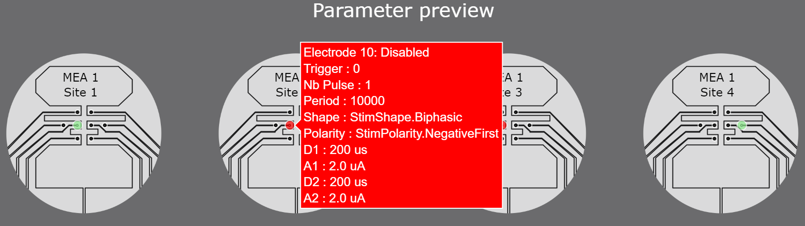
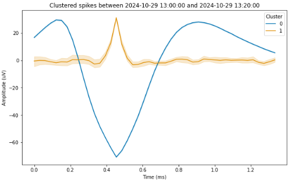
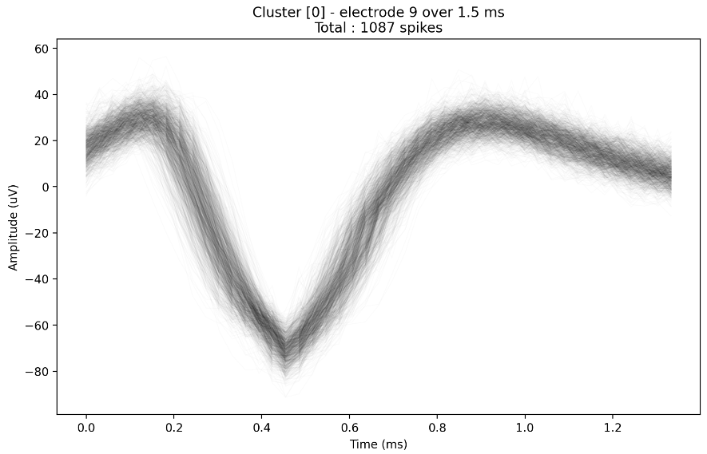
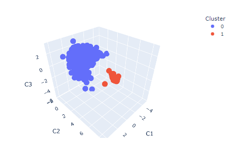

# np-utils

This repository hosts a collection of utilities intended to be used by Neuroplatform users.

## Contributions and issues

We welcome any feedback, issues or contributions to this repository. Please use the Issues tab to report any problems or suggest improvements.

You are also welcome to add your own utilities or suggest changes using Pull Requests.

We only ask that you share utilities built upon the NeuroPlatform API without sharing core code or data from the NeuroPlatform itself.

If you have any questions, please contact us.

## Documentation

See the [official NeuroPlatform documentation](https://finalspark-np.github.io/np-docs/welcome.html#navigation).

## Installation

The use of some the utilities' code requires access to the FinalSpark Neuroplatform.

Please contact us if you have a request pertaining to using these utilities in your Neuroplatform project.

Additionally, python>=3.11 is required for some of the utilities to work. If your provided Neuroplatform environment does not have python>=3.11, please contact us.

To install the utilities, you can install from GitHub the required packages using the following commands:

- Install all dependencies :

```bash
pip install git+https://github.com/FinalSpark-np/np-utils.git#egg=np-utils[all]
```

- Install only the StimParamLoader dependencies :

```bash
pip install git+https://github.com/FinalSpark-np/np-utils.git#egg=np-utils[SPL]
```

- Install only the SpikeSorting dependencies :

```bash
pip install git+https://github.com/FinalSpark-np/np-utils.git#egg=np-utils[SSG]
```

- Install only the RawRecordingLoader dependencies :

```bash
pip install git+https://github.com/FinalSpark-np/np-utils.git#egg=np-utils[RRL]
```

- Install only the CrossCorrelogram dependencies :

```bash
pip install git+https://github.com/FinalSpark-np/np-utils.git#egg=np-utils[CCM]
```

## Contents

### StimParamLoader

This utility is used to help you setup and send your stimulation parameters to our system.

**NOTE for deployment:** Make sure the MEA schema image is placed appropriately in the same folder as the .py, and that the path is correctly set in the code.

Features :

- Automated checking of your parameters for errors or redundancies
- An interactive preview of your parameters, to easily keep track of what you are sending and spot any mistakes
- A simple way to send your parameters to the system
- A simple way to disable all parameters currently on the system, to help you properly finish your experiment

<div style="text-align: center;">
  
  <p><em>Example of the parameters preview</em></p>
</div>

### SpikeSorting

This utility is used to perform a simple spike sorting operation on the raw spiking data in our database.

This will assign each spike to a cluster, which can then be used for your data analysis.

It requires a certain number of minimum events for proper operation; you may want to adjust the number of components

Features :

- Automated artifact/spike discrimination
- Spike sorting using :
  - ICA or PCA (dimensionality reduction)
  - HDBSCAN or OPTICS (clustering)
- Several plots of the resulting clusters
  - Plot of average trace for each cluster
  - 3D plot of the clusters in the PCA/ICA latent space
  - Plot of all raw traces for a selection of clusters

<div style="text-align: center;">
  
  <p><em>Example of a line plot of the average trace for each cluster</em></p>
</div>

<div style="text-align: center;">
  
  <p><em>Example of a line plot of all raw traces for a selection of clusters</em></p>

<div style="text-align: center;">
  
  <p><em>Example of a 3D plot of the clusters in the PCA/ICA latent space</em></p>

### RawRecordingLoader

A tool to load raw recordings from the Neuroplatform database.

*Note : if you wish to perform raw recordings, please contact us to get access to the raw recording feature. In the future, this will be accessible to all Neuroplatform users, but currently requires manual adjustments.*

Features :

- Load raw recordings from an h5 file
  - Choose which channels to load
  - For memory-heavy recordings, specify either the index or the time range of the recording you wish to load


### CrossCorrelogram

A tool to compute the cross-correlogram between two spike trains.

Features :

- Compute the cross-correlogram between two spike trains
  - Fast numba-based implementation
  - Plotting utilities to visualize the cross-correlogram
